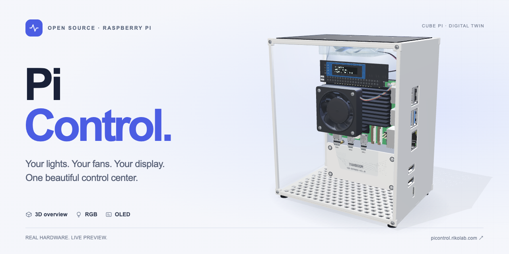

# Pi Control

[](https://picontrol.rikolab.com)

把树莓派的灯光、风扇和 OLED 放进一个可视化控制台。

**[在线预览 ↗](https://picontrol.rikolab.com)** · [接入指南](deploy/INSTALL.md) · [API 文档](https://picontrol.rikolab.com/api-docs.html)

无需树莓派就能体验：旋转和展开 3D 机箱、切换灯效、调整风扇、编辑 OLED。在线预览为纯静态演示，操作只保存在当前浏览器，不连接真实设备。

## 看看演示

25 秒，看看三维机箱如何旋转、放大和展开。

https://github.com/user-attachments/assets/a4b59939-f189-4fb2-aad8-9bd871ecdcc2

[打开视频播放页 ↗](https://picontrol.rikolab.com/demo.html) · [下载 MP4](docs/media/pi-control-demo.mp4) · [亲自体验 ↗](https://picontrol.rikolab.com)

## 可以做什么

- **三维总览**：查看 CUBE Pi 内部布局，旋转、缩放、展开部件。
- **灯光**：逐颗控制 14 颗灯珠，使用原厂呼吸、彩虹等效果，保存喜欢的场景。
- **风扇**：调节顶部风扇，选择温控预设；查看 CPU 风扇转速与温度。
- **OLED**：显示系统信息、时钟、自定义文字或像素画，同步预览屏幕内容。
- **设备与记录**：扫描兼容部件，在已保存设备和演示设备间切换，查询变化历史。
- **开放接口**：提供 HTTP API，方便脚本和其他应用接入。

## 支持哪些硬件

| 硬件 | 用途 |
| --- | --- |
| Raspberry Pi 5 + Raspberry Pi OS 64 位 | 运行真实设备服务 |
| [Yahboom CUBE Pi 机箱及拓展板](https://www.yahboom.com/study_module/CUBE_Pi) | 顶部风扇、14 颗 RGB 灯珠控制 |
| SSD1306 128 × 32 OLED | 屏幕显示 |
| 接在树莓派专用接口上的 CPU 风扇 | 读取转速与系统温控状态 |
| NVMe SSD（可选） | 系统或存储；不影响控制功能 |

组件可以缺省，没有接上的部件可在页面停用。CPU 风扇由树莓派系统自动调速。3D 视图按 CUBE Pi 机箱建模，并不代表任意机箱都能自动生成模型。

## 开始使用

### 先在 Docker 里体验

准备好 Docker 和 Compose：

```sh
git clone https://github.com/riko2chen/RaspberryPiControl.git
cd RaspberryPiControl
docker compose up -d --build --wait
```

打开 **[ http://localhost:8080 ](http://localhost:8080)** ，默认进入演示设备。设置会保留在 Docker 数据卷里。

在“设备连接”里可添加已经安装 Pi Control 的树莓派。连接真实设备后，右上角“切换设备”可以返回设备列表。

### 接入自己的树莓派

在树莓派上安装 Docker 和 Compose、下载上面的仓库，然后运行：

```sh
sudo python3 deploy/install.py --name "我的树莓派"
```

按提示设置网页密码，打开安装器给出的地址即可。镜像已包含 CUBE 灯光、顶部风扇和 OLED 的控制程序；安装器负责准备系统接口。首次启用 I²C 可能需要重启。

支持局域网与已配置好的 Tailscale。详细要求、手动 Compose 部署和升级方式见 [接入指南](deploy/INSTALL.md)。

## 演示与隐私

- 在线预览只托管静态文件，没有设备后端，也不接收你的硬件控制请求。
- 演示设置与历史仅保存在浏览器，可用“重置演示”清空。
- 真实设备的密码、令牌、连接记录和数据库保存在自己的部署中，不包含在源码或镜像里。
- 公开预览与真实设备服务独立，无需把家里的树莓派暴露到公网。

纯静态版本也能放到 GitHub Pages 或其他静态托管平台，见 [演示部署说明](docs/STATIC-DEMO.md)。

## 更多

[开发与测试](docs/DEVELOPMENT.md) · [3D 模型说明](deploy/3D-MODEL.md) · [验证范围](docs/LOCAL-VERIFICATION.md) · [第三方资源](THIRD_PARTY.md)

项目代码采用 [MIT 许可证](LICENSE)。第三方模型、字体和依赖保留各自许可。本项目与 Raspberry Pi、Yahboom 无官方隶属关系。
